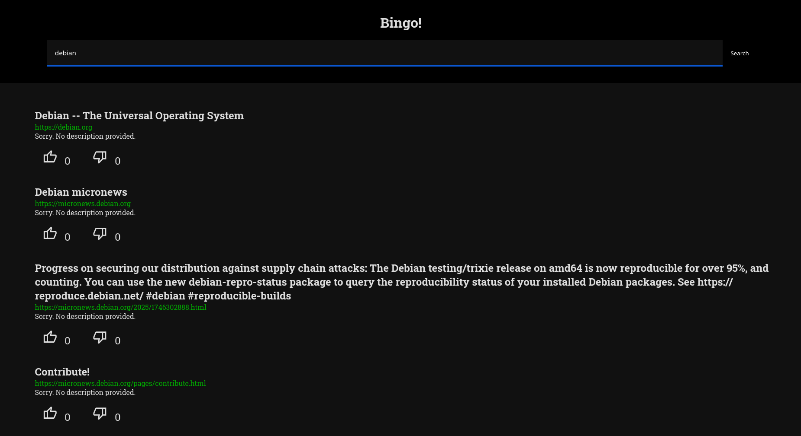

# Bingo
A very hobbyist, simple, open-source, self-hosted and private search index tracker with a nice search UI.

Bingo is self-hosted, meaning, you can set up your own instance at home and use it however you like.
You can customize it however you want, including the search index!



> Note: Bingo can be used as a simple search engine for WWW, intranet networks or whatever you like. You host it, do whatever you want.
But remember, that currently, it is a barebone project with few optimisations.
I don't think it's ready for very large indexes and production use.

## Community driven, SEO free
Most of the website designers don't care about readability, usability and accessibility of their websites and articles.
It doesn't matter how good your website is, because today the only thing that matters is traffic.
The more traffic you get, the more ads people see on your website. And the more people see, the more profit goes to the authors.

But how to get all of the traffic? Simply, by manipulating search engines.

For example, if you convince a search engine, like Google, that your website about making spaghetti is also a good source of
knowlegde about other meals, nuclear fusion, cats, dogs and managing Ubuntu Server over Microsoft Paint - your website will show up in many,
different queries generating lots of new ways to get traffic.

When SEO-driven search engines appeared on the web, they provided an easy way to **discover new stuff**.
You would simply type what you want, and then Google would show you a bunch of links with descriptions.
All sorted up, from best to worst looking sites, using the magic of algorithm.
That was a great idea!

Until everyone started a chaotic rush to catch the algorithm. Everyone wanted to be on the top. And the results?
Half of the web is filled up with buzz-words.

Let's face it. SEO is now officially dead.
And this is why Bingo doesn't care about website's content, time of creation or even authors.
All that matters, is a title, description, domain name and like or dislikes given by the users.

## How to use it?
Install dependencies listed below.
To start using it, run `main.py` script and provide it an argument. A website that has to be scanned.

```
$ python3 main.py 'https://wikipedia.org'
```

When you're done collecting your results, run PHP server from project's directory and just start browsing!

## Dependencies

- Install Python libraries listed in `requirements.txt` (`pip install -r requirements.txt`)
- Chromium: Any chromium-based browser is required for [selenium](https://www.selenium.dev/) to work in the background
- PHP: for the PHP server of course
- php-pdo: PDO driver for PHP
- And optional stuff:
  - Apache or Nginx: To host your instance with PHP without accessing 
